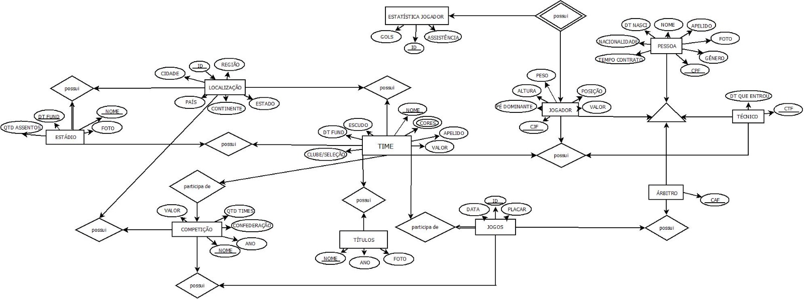
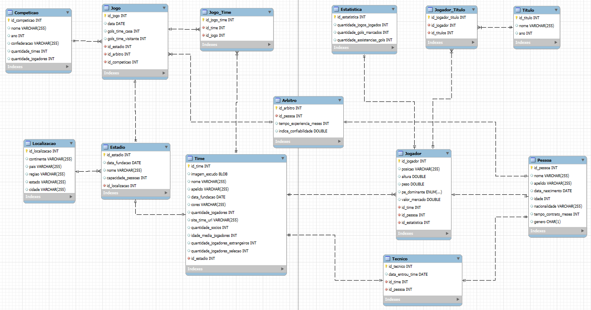

# Sobre o projeto

Este projeto de Banco de Dados foi desenvolvido para atender às especificações da disciplina Banco de Dados do Departamento de Ciência da Computação da Universidade de Brasília. 
O objetivo principal é criar um sistema funcional com um banco de dados relacional, utilizando boas práticas de modelagem e implementação.[Especificações](./pdf/especificacao_projeto.pdf)

# Participantes

- FELIPE COSTA DE SOUSA - 211055236
- GUSTAVO VIEIRA DE ARAÚJO - 211068440
- ADRIELLY VITORIA COSTA DE LIMA - 231018973
- PEDRO RODRIGUES DIOGENES MACEDO - 211042739

# Cardinalidade e Participação das Entidades

## 1. Relacionamento entre Jogo e Competição

-   **Cardinalidade:**
    -   Uma competição → vários jogos (1:N).
    -   Um jogo → uma competição (N:1).
-   **Participação:**
    -   **Jogo:** Opcional (pode estar vinculado a uma competição, ou não).
    -   **Competição:** Obrigatório (sempre tem um jogo).

## 2. Relacionamento entre Jogo e Árbitro

-   **Cardinalidade:**
    -   Um jogo → um árbitro (1:1).
    -   Um árbitro → vários jogos (N:1).
-   **Participação:**
    -   **Jogo:** Obrigatória (sempre tem um árbitro).
    -   **Árbitro:** Opcional (pode estar vinculado a um jogo, ou não).

## 3. Relacionamento entre Jogo e Estádio

-   **Cardinalidade:**
    -   Um jogo → um estádio (1:1).
    -   Um estádio → vários jogos (N:1).
-   **Participação:**
    -   **Jogo:** Obrigatória (sempre tem um estádio).
    -   **Estádio:** Opcional (pode estar vinculado a um jogo, ou não).

## 4. Relacionamento entre Jogo e Time

-   **Cardinalidade:**
    -   Um jogo → vários times (N:M).
    -   Um time → vários jogos (M:N).
-   **Participação:**
    -   **Jogo:** Obrigatória (sempre tem time vinculados).
    -   **Time:** Opcional (pode estar vinculado a um jogo, ou não).

## 5. Relacionamento entre Estádio e Localização

-   **Cardinalidade:**
    -   Um estádio → uma localização (1:1).
    -   Uma localização → vários estádios (N:1).
-   **Participação:**
    -   **Estádio:** Obrigatória (sempre tem uma localização).
    -   **Localização:** Opcional (pode estar vinculado a uma localização, ou não).

## 6. Relacionamento entre Estádio e Time

-   **Cardinalidade:**
    -   Um estádio → um time (1:1).
    -   Um time → um estádio (1:1).
-   **Participação:**
    -  **Estádio:** Opcional (pode estar vinculado a um time, ou não).
    -  **Time:** Opcional (pode estar vinculado a um estadio, ou não).

## 7. Relacionamento entre Time e Jogador

-   **Cardinalidade:**
    -   Um time → vários jogadores (1:N).
    -   Um jogador → um time (N:1).
-   **Participação:**
    -   **Time:** Obrigatória (sempre tem  jogadores).
    -   **Jogador:** Opcional (pode estar vinculado a um time, ou não).

## 8. Relacionamento entre Time e Técnico

-   **Cardinalidade:**
    -   Um time → um técnico (1:1).
    -   Um técnico → um time (1:1).
-   **Participação:**
     -   **Time:** Obrigatória (sempre tem tecnico).
     -   **Tecnico:** Opcional (pode estar vinculado a um time, ou não).

## 9. Relacionamento entre Jogador e Título

-   **Cardinalidade:**
    -   Um jogador → vários títulos (1:N).
    -   Um título → vários jogadores (N:M).
-   **Participação:**
    -   Ambos são opcionais.

## 10. Relacionamento entre Jogador e Estatística

-   **Cardinalidade:**
    -   Um jogador → uma estatística (1:1).
    -   Uma estatística → um jogador (1:1).
-   **Participação:**
    -   Ambos são obrigatórios.

## 11. Relacionamento entre Pessoa e Jogador

-   **Cardinalidade:**
    -   Um jogador → uma pessoa (1:1).
    -   Uma pessoa → um jogador (1:1).
-   **Participação:**
    -   Ambos são obrigatórios.

## 12. Relacionamento entre Pessoa e Técnico

-   **Cardinalidade:**
    -   Um técnico → uma pessoa (1:1).
    -   Uma pessoa → um técnico (1:1).
-   **Participação:**
    -   Ambos são obrigatórios.

## 13. Relacionamento entre Pessoa e Árbitro

-   **Cardinalidade:**
    -   Um árbitro → uma pessoa (1:1).
    -   Uma pessoa → um árbitro (1:1).
-   **Participação:**
    -   Ambos são obrigatórios.

# Modelo de Entidade Relacionamento

# Modelo Relacional (MySQL Workbench)

