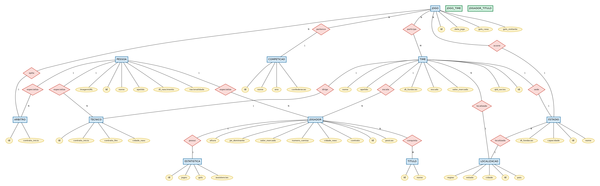

# Banco de Dados de Futebol

Projeto da disciplina **Banco de Dados** do Departamento de Ciencia da Computacao da Universidade de Brasilia ([especificacao](./pdfs/especificacao_projeto.pdf)). Modela um sistema completo de futebol utilizando PostgreSQL, com dados reais populados automaticamente via API do [Transfermarkt](https://www.transfermarkt.com/).

---

## Sumario

- [Participantes](#participantes)
- [Tecnologias](#tecnologias)
- [Escopo do Projeto](#escopo-do-projeto)
- [Estrutura do Projeto](#estrutura-do-projeto)
- [Requisitos](#requisitos)
- [Configuracao](#configuracao)
- [Como Executar](#como-executar)
- [Modelo de Entidade Relacionamento](#modelo-de-entidade-relacionamento)
- [Modelo Relacional](#modelo-relacional)
- [Cardinalidade e Participacao](#cardinalidade-e-participacao)
- [View](#view)
- [Procedure](#procedure)
- [Avaliacao das Formas Normais](#avaliacao-das-formas-normais)
- [Consultas SQL e Algebra Relacional](#consultas-sql-e-algebra-relacional)

---

## Participantes

| Nome                              | Matricula |
|-----------------------------------|-----------|
| Felipe Costa de Sousa             | 211055236 |
| Gustavo Vieira de Araujo          | 211068440 |
| Adrielly Vitoria Costa de Lima    | 231018973 |
| Pedro Rodrigues Diogenes Macedo   | 211042739 |

---

## Tecnologias

| Tecnologia   | Uso                                                        |
|--------------|------------------------------------------------------------|
| PostgreSQL   | SGBD relacional: armazenamento, views, procedures         |
| Python 3     | Scripts de seed (populacao via API) e conexoes com o banco  |
| psycopg2     | Driver PostgreSQL para Python                              |
| Transfermarkt API | Fonte de dados reais (jogadores, clubes, tecnicos, arbitros) |
| Graphviz     | Diagramas MER (Chen) e MR (tabelas) em SVG                 |
| RelaX        | Validacao das consultas em Algebra Relacional               |

---

## Escopo do Projeto

| Requisito da disciplina                              | Implementacao                                                       |
|------------------------------------------------------|---------------------------------------------------------------------|
| Minimo 10 entidades                                  | 14 tabelas (Pessoa, Jogador, Time, Tecnico, Arbitro, Estadio, etc.) |
| Minimo 5 registros por tabela                        | Populado via API com dados reais de competicoes                     |
| CRUD funcionando (min. 3 tabelas relacionadas)       | Create via scripts Python com `psycopg2` (seed/insert_*.py, sobre Pessoa, Jogador e Time); Read via `vw_jogadores_completo`; Update via procedure `transferir_jogador` |
| Modelo de Entidade Relacionamento                    | Diagrama MER com notacao Chen (Graphviz SVG)                       |
| Modelo Relacional                                    | Diagrama MR com tabelas, tipos SQL, PKs e FKs (Graphviz SVG)      |
| 5 consultas em Algebra Relacional (3+ tabelas)       | 5 consultas com SQL e algebra relacional documentadas               |
| Pelo menos 1 View                                    | `vw_jogadores_completo`: 5 tabelas (Jogador, Pessoa, Time, Localizacao, Estatistica) |
| Pelo menos 1 Procedure (com condicionais)            | `transferir_jogador`: valida existencia, verifica duplicidade, atualiza contrato |
| Avaliacao das formas normais em 5 tabelas            | Analise de 1FN, 2FN e 3FN documentada no README                    |
| Insercao de dado binario                             | Imagem de escudo do time armazenada como `BYTEA`                    |
| SGBD relacional                                      | PostgreSQL                                                          |

---

## Estrutura do Projeto

| Diretorio / Arquivo                    | Descricao                                                             |
|----------------------------------------|-----------------------------------------------------------------------|
| `sql/`                                 | DDL (CREATE TABLE), View e Procedure                                  |
| `sql/tabela_pessoa.sql`                | Entidade base (nome, apelido, nascimento, nacionalidade, foto)        |
| `sql/tabela_jogador.sql`               | Jogador (posicao, altura, pe dominante, valor, camisa, agente)        |
| `sql/tabela_time.sql`                  | Time (nome, escudo, fundacao, socios, valor de mercado)               |
| `sql/tabela_tecnico.sql`               | Tecnico (contrato, cidade de nascimento)                              |
| `sql/tabela_arbitro.sql`               | Arbitro (inicio de contrato)                                          |
| `sql/tabela_estadio.sql`               | Estadio (nome, fundacao, capacidade)                                  |
| `sql/tabela_localizacao.sql`           | Localizacao (pais, regiao, estado, cidade)                            |
| `sql/tabela_competicao.sql`            | Competicao (nome, ano, confederacao)                                  |
| `sql/tabela_jogo.sql`                  | Jogo (data, gols casa/visitante, estadio, arbitro, competicao)        |
| `sql/tabela_jogo_time.sql`             | Relacao N:M entre Jogo e Time                                         |
| `sql/tabela_titulo.sql`                | Titulo (nome)                                                         |
| `sql/tabela_jogador_titulo.sql`        | Relacao N:M entre Jogador e Titulo                                    |
| `sql/tabela_estatistica.sql`           | Estatistica (jogos, gols, assistencias)                               |
| `sql/view_jogadores_completo.sql`      | View que consolida jogador, pessoa, time, localizacao e estatistica    |
| `sql/procedure_transferir_jogador.sql` | Procedure para transferir jogador entre times com validacoes           |
| `seed/`                                | Scripts Python para popular o banco via API Transfermarkt              |
| `seed/players.py`                      | Seed de jogadores por competicao                                      |
| `seed/clubs.py`                        | Seed de clubes/times por competicao                                   |
| `seed/coaches.py`                      | Seed de tecnicos por competicao                                       |
| `seed/referees.py`                     | Seed de arbitros (IDs fixos)                                          |
| `seed/translate.py`                    | Traducao de campos (posicao, pais, pe dominante, valor de mercado)    |
| `seed/connect_postgresql_database.py`  | Conexao com PostgreSQL via variaveis de ambiente                      |
| `seed/get_*.py`                        | Funcoes de consulta a API (jogadores, clubes, tecnicos, arbitros)     |
| `seed/insert_*.py`                     | Funcoes de insercao no banco                                          |
| `concatenate_sql/`                     | Gera um unico arquivo SQL com todo o schema                          |
| `relax/`                               | Schema para testar algebra relacional na ferramenta RelaX             |
| `pdfs/`                                | Especificacao do projeto                                              |
| `.env.example`                         | Modelo das variaveis de ambiente necessarias                          |

---

## Requisitos

- PostgreSQL 12+
- Python 3.8+
- Bibliotecas Python: `psycopg2`, `requests`, `python-dotenv`

```bash
pip install psycopg2-binary requests python-dotenv
```

---

## Configuracao

Copie o arquivo de exemplo e preencha com suas credenciais:

```bash
cp .env.example .env
```

Edite o `.env` com os dados do seu PostgreSQL e, se necessario, a API key do RapidAPI (usada pelos seeds de tecnicos e arbitros).

---

## Como Executar

### 1. Criar o banco e as tabelas

As tabelas devem ser criadas na ordem abaixo para respeitar as dependencias de chave estrangeira:

```
1.  tabela_pessoa.sql                    (sem dependencias)
2.  tabela_localizacao.sql               (sem dependencias)
3.  tabela_competicao.sql                (sem dependencias)
4.  tabela_titulo.sql                    (sem dependencias)
5.  tabela_estadio.sql                   (depende de Localizacao)
6.  tabela_time.sql                      (depende de Estadio, Localizacao)
7.  tabela_arbitro.sql                   (depende de Pessoa)
8.  tabela_tecnico.sql                   (depende de Time, Pessoa)
9.  tabela_jogo.sql                      (depende de Estadio, Arbitro, Competicao)
10. tabela_jogador.sql                   (depende de Time, Pessoa)
11. tabela_jogo_time.sql                 (depende de Time, Jogo)
12. tabela_jogador_titulo.sql            (depende de Jogador, Titulo)
13. tabela_estatistica.sql               (depende de Jogador)
14. view_jogadores_completo.sql          (View, depende das tabelas acima)
15. procedure_transferir_jogador.sql     (Procedure)
```

Ou gere um unico arquivo com todo o schema automaticamente:

```bash
python3 concatenate_sql/concatenar_sql_schema_bd.py
psql -U postgres -d soccer -f schema_banco_dados.sql
```

### 2. Popular o banco com dados da API

```bash
cd seed

# Popular jogadores (pede o nome da competicao, ex: "Brasileirao")
python3 players.py

# Popular clubes
python3 clubs.py

# Popular tecnicos (pede o id da competicao)
python3 coaches.py

# Popular arbitros
python3 referees.py
```

### 3. Criar a View e a Procedure

```bash
psql -U postgres -d soccer -f sql/view_jogadores_completo.sql
psql -U postgres -d soccer -f sql/procedure_transferir_jogador.sql
```

---


## Modelo de Entidade Relacionamento

Diagrama conceitual com notacao Chen: entidades (retangulos), atributos (elipses), relacionamentos (losangos) e cardinalidades (1, N, M).



> [Abrir em tela cheia](./diagrams_images/modelo_entidade_relacionamento.png) | Fonte: [`diagrams/mer.dot`](./diagrams/mer.dot)

---

## Modelo Relacional

Diagrama logico com tabelas, tipos SQL do PostgreSQL, chaves primarias (sublinhadas) e chaves estrangeiras (italico). Tabelas associativas em verde.


> [Abrir em tela cheia](./diagrams_images/modelo_relacional.png) | Fonte: [`diagrams/mr.dot`](./diagrams/mr.dot)

---

## Cardinalidade e Participacao

| Relacionamento           | Cardinalidade                                        | Participacao                              |
|--------------------------|------------------------------------------------------|-------------------------------------------|
| Jogo / Competicao        | 1:N (competicao tem varios jogos)                    | Jogo: obrigatoria / Competicao: opcional  |
| Jogo / Arbitro           | N:1 (arbitro apita varios jogos)                     | Jogo: obrigatoria / Arbitro: opcional     |
| Jogo / Estadio           | N:1 (estadio sedia varios jogos)                     | Jogo: obrigatoria / Estadio: opcional     |
| Jogo / Time              | N:M (jogo tem varios times, time joga varios jogos)  | Jogo: obrigatoria / Time: opcional        |
| Estadio / Localizacao    | N:1 (localizacao tem varios estadios)                | Estadio: obrigatoria / Localizacao: opcional |
| Estadio / Time           | 1:1 (time tem um estadio sede)                       | Ambos opcionais                           |
| Time / Jogador           | 1:N (time tem varios jogadores)                      | Ambos opcionais                           |
| Time / Tecnico           | 1:1 (time tem um tecnico)                            | Ambos opcionais                           |
| Time / Localizacao       | N:1 (localizacao tem varios times)                   | Time: obrigatoria / Localizacao: opcional |
| Jogador / Titulo         | N:M (jogador tem varios titulos)                     | Ambos opcionais                           |
| Jogador / Estatistica    | 1:1                                                  | Ambos obrigatorios                        |

---

## View

**`vw_jogadores_completo`**: consolida dados de 5 tabelas (Jogador, Pessoa, Time, Localizacao, Estatistica) em uma unica visao, facilitando consultas sobre jogadores com informacoes do time e desempenho.

```sql
CREATE OR REPLACE VIEW vw_jogadores_completo AS
SELECT
    p.nome              AS nome_jogador,
    p.apelido,
    p.nacionalidade,
    p.data_nascimento,
    j.posicao,
    j.altura,
    j.pe_dominante,
    j.valor_mercado,
    j.numero_camisa,
    t.nome              AS nome_time,
    l.cidade            AS cidade_time,
    l.pais              AS pais_time,
    e.quantidade_jogos_jogados,
    e.quantidade_gols_marcados,
    e.quantidade_assistencias_gols
FROM Jogador j
JOIN Pessoa p       ON j.id_pessoa = p.id
JOIN Time t         ON j.id_time = t.id
JOIN Localizacao l  ON t.id_localizacao = l.id
LEFT JOIN Estatistica e ON e.id_jogador = j.id;
```

Exemplo de uso:

```sql
SELECT nome_jogador, posicao, nome_time, quantidade_gols_marcados
FROM vw_jogadores_completo
WHERE pais_time = 'Brasil'
ORDER BY quantidade_gols_marcados DESC;
```

---

## Procedure

**`transferir_jogador(p_jogador_id, p_novo_time_id)`**: realiza a transferencia de um jogador entre times com as seguintes validacoes condicionais:

1. Verifica se o jogador existe
2. Verifica se o time destino existe
3. Verifica se o jogador ja pertence ao time (evita transferencia redundante)
4. Trata o caso de jogador sem time atual
5. Atualiza o time e a data de inicio de contrato

```sql
CREATE OR REPLACE PROCEDURE transferir_jogador(
    p_jogador_id INT,
    p_novo_time_id INT
)
LANGUAGE plpgsql AS $$
DECLARE
    v_time_atual INT;
    v_nome_jogador VARCHAR;
    v_nome_time_novo VARCHAR;
BEGIN
    IF NOT EXISTS (SELECT 1 FROM Jogador WHERE id = p_jogador_id) THEN
        RAISE EXCEPTION 'Jogador com id % nao encontrado', p_jogador_id;
    END IF;

    IF NOT EXISTS (SELECT 1 FROM Time WHERE id = p_novo_time_id) THEN
        RAISE EXCEPTION 'Time com id % nao encontrado', p_novo_time_id;
    END IF;

    SELECT id_time INTO v_time_atual FROM Jogador WHERE id = p_jogador_id;

    IF v_time_atual = p_novo_time_id THEN
        RAISE NOTICE 'Jogador ja pertence a este time. Nenhuma alteracao realizada.';
        RETURN;
    END IF;

    IF v_time_atual IS NULL THEN
        RAISE NOTICE 'Jogador sem time atual. Atribuindo diretamente.';
    END IF;

    UPDATE Jogador
    SET id_time = p_novo_time_id,
        contrato_incio = CURRENT_DATE
    WHERE id = p_jogador_id;

    SELECT p.nome INTO v_nome_jogador
    FROM Jogador j JOIN Pessoa p ON j.id_pessoa = p.id
    WHERE j.id = p_jogador_id;

    SELECT nome INTO v_nome_time_novo FROM Time WHERE id = p_novo_time_id;

    RAISE NOTICE 'Transferencia concluida: % -> %', v_nome_jogador, v_nome_time_novo;
END;
$$;
```

Exemplo de uso:

```sql
CALL transferir_jogador(1, 2);
```

---

## Avaliacao das Formas Normais

Analise de normalizacao de 5 tabelas do banco de dados.

### Pessoa

| Forma Normal | Atende? | Justificativa |
|---|---|---|
| 1FN | Sim | Todos os atributos sao atomicos (nome, apelido, data_nascimento, nacionalidade, imagemURL). Nao ha atributos multivalorados ou compostos. |
| 2FN | Sim | A chave primaria e simples (`id`), portanto nao existe dependencia parcial: todos os atributos dependem integralmente da PK. |
| 3FN | Sim | Nao ha dependencias transitivas. Todos os atributos (nome, apelido, nacionalidade, etc.) dependem diretamente de `id`. |

### Jogador

| Forma Normal | Atende? | Justificativa |
|---|---|---|
| 1FN | Sim | Todos os atributos sao atomicos. `pe_dominante` e restrito via CHECK a valores fixos ('Esquerda', 'Direita', 'Ambos'). |
| 2FN | Sim | Chave primaria simples (`id`). Todos os atributos dependem integralmente da PK. |
| 3FN | Sim | `id_time` e `id_pessoa` sao chaves estrangeiras, nao criam dependencia transitiva: referenciam entidades externas sem trazer seus atributos para dentro da tabela. |

### Time

| Forma Normal | Atende? | Justificativa |
|---|---|---|
| 1FN | Sim | Todos os atributos sao atomicos. `imagem_escudo` e armazenado como `BYTEA` (dado binario unico, nao multivalorado). |
| 2FN | Sim | Chave primaria simples (`id`). Sem dependencia parcial. |
| 3FN | Sim | `id_estadio` e `id_localizacao` sao FKs que referenciam entidades externas. Os demais atributos (nome, apelido, data_fundacao, valor_mercado, etc.) dependem diretamente de `id`. |

### Jogo

| Forma Normal | Atende? | Justificativa |
|---|---|---|
| 1FN | Sim | Todos os atributos sao atomicos. Gols de casa e visitante sao campos separados (`gols_time_casa`, `gols_time_visitante`). |
| 2FN | Sim | Chave primaria simples (`id`). Todos os atributos dependem integralmente da PK. |
| 3FN | Sim | `id_estadio`, `id_arbitro` e `id_competicao` sao FKs. Nao ha dependencia transitiva (por exemplo, o nome do estadio nao esta nesta tabela, apenas o `id_estadio`). |

### Estatistica

| Forma Normal | Atende? | Justificativa |
|---|---|---|
| 1FN | Sim | Todos os atributos sao atomicos (quantidades inteiras). |
| 2FN | Sim | Chave primaria simples (`id`). Sem dependencia parcial. |
| 3FN | Sim | `id_jogador` e FK. Os atributos de desempenho (jogos, gols, assistencias) dependem diretamente do registro de estatistica, sem transitividade. |

---

## Consultas SQL e Algebra Relacional

### Consulta 1: Jogadores, times e competicoes

Selecao de jogadores, seus respectivos times e competicoes em que participaram.

**SQL:**

```sql
SELECT Jogador.id AS id_jogador, Jogador.posicao, Time.nome AS nome_time, Competicao.nome AS nome_competicao
FROM Jogador
JOIN Time ON Jogador.id_time = Time.id
JOIN Jogo_Time ON Jogo_Time.id_time = Time.id
JOIN Jogo ON Jogo_Time.id_jogo = Jogo.id
JOIN Competicao ON Jogo.id_competicao = Competicao.id;
```

**Algebra Relacional:**

```
ρ id_jogador←Jogador.id, nome_time←Time.nome, competicao_nome←Competicao.nome
π Jogador.id, Jogador.posicao, Time.nome, Competicao.nome (
    ((( Jogador ⨝ Jogador.id_time = Time.id Time )
       ⨝ Jogo_Time.id_time = Time.id Jogo_Time )
       ⨝ Jogo_Time.id_jogo = Jogo.id Jogo )
       ⨝ Jogo.id_competicao = Competicao.id Competicao
)
```

<details>
<summary>Construcao passo a passo</summary>

1. Juntar Jogador com Time pelo `id_time`:
```sql
A = SELECT Jogador.id, Jogador.posicao, Time.nome FROM Jogador JOIN Time ON Jogador.id_time = Time.id;
```

2. Incluir Jogo_Time para acessar os jogos do time:
```sql
B = A JOIN Jogo_Time ON Jogo_Time.id_time = Time.id;
```

3. Incluir Jogo para acessar a competicao:
```sql
C = B JOIN Jogo ON Jogo.id = Jogo_Time.id_jogo;
```

4. Incluir Competicao pelo `id_competicao`:
```sql
D = C JOIN Competicao ON Jogo.id_competicao = Competicao.id;
```

5. Projecao das colunas desejadas e renomeacao.

</details>

---

### Consulta 2: Titulos por time

Selecao de titulos conquistados pelos jogadores em um time especifico.

**SQL:**

```sql
SELECT Jogador.id AS id_jogador, Titulo.nome AS titulo_nome
FROM Jogador
JOIN Jogador_Titulo ON Jogador.id = Jogador_Titulo.id_jogador
JOIN Titulo ON Jogador_Titulo.id_titulo = Titulo.id
JOIN Time ON Jogador.id_time = Time.id
WHERE Time.nome = 'TimeTeste1';
```

**Algebra Relacional:**

```
ρ id_jogador←Jogador.id, titulo_nome←Titulo.nome
π Jogador.id, Titulo.nome
σ Time.nome = 'TimeTeste1' (
    (( Jogador ⨝ Jogador.id = Jogador_Titulo.id_jogador Jogador_Titulo )
       ⨝ Jogador_Titulo.id_titulo = Titulo.id Titulo )
       ⨝ Jogador.id_time = Time.id Time
)
```

<details>
<summary>Construcao passo a passo</summary>

1. Juntar Jogador com Jogador_Titulo para acessar os titulos.
2. Incluir Titulo para obter o nome do titulo.
3. Incluir Time para filtrar por time.
4. Selecao (`σ`) onde `Time.nome = 'TimeTeste1'`.
5. Projecao e renomeacao.

</details>

---

### Consulta 3: Arbitros, jogos e estadios

Exibicao dos arbitros, os jogos que apitaram e os estadios onde ocorreram.

**SQL:**

```sql
SELECT Arbitro.id AS id_arbitro, Jogo.id AS id_jogo, Jogo.data AS data_jogo, Estadio.nome AS nome_estadio
FROM Arbitro
JOIN Jogo ON Arbitro.id = Jogo.id_arbitro
JOIN Estadio ON Jogo.id_estadio = Estadio.id;
```

**Algebra Relacional:**

```
ρ id_arbitro←Arbitro.id, id_jogo←Jogo.id, data_jogo←Jogo.data, nome_estadio←Estadio.nome
π Arbitro.id, Jogo.id, Jogo.data, Estadio.nome (
    ( Arbitro ⨝ Arbitro.id = Jogo.id_arbitro Jogo )
    ⨝ Jogo.id_estadio = Estadio.id Estadio
)
```

<details>
<summary>Construcao passo a passo</summary>

1. Juntar Arbitro com Jogo pelo `id_arbitro`.
2. Incluir Estadio pelo `id_estadio`.
3. Projecao e renomeacao.

</details>

---

### Consulta 4: Jogadores, estatisticas e times

Listagem de jogadores, suas estatisticas e o time ao qual pertencem.

**SQL:**

```sql
SELECT Jogador.id AS id_jogador, Estatistica.quantidade_jogos_jogados, Time.nome AS nome_time
FROM Jogador
JOIN Estatistica ON Estatistica.id_jogador = Jogador.id
JOIN Time ON Jogador.id_time = Time.id;
```

**Algebra Relacional:**

```
ρ id_jogador←Jogador.id, nome_time←Time.nome
π Jogador.id, Estatistica.quantidade_jogos_jogados, Time.nome (
    ( Jogador ⨝ Estatistica.id_jogador = Jogador.id Estatistica )
    ⨝ Jogador.id_time = Time.id Time
)
```

<details>
<summary>Construcao passo a passo</summary>

1. Juntar Jogador com Estatistica pelo `id_jogador`.
2. Incluir Time pelo `id_time`.
3. Projecao e renomeacao.

</details>

---

### Consulta 5: Jogos, times e estadios

Selecao de jogos, os times que participaram (casa e visitante) e o estadio.

**SQL:**

```sql
SELECT Jogo.id AS id_jogo, TimeCasa.nome AS nome_time_casa,
       TimeVisitante.nome AS nome_time_visitante, Jogo.data, Estadio.nome AS nome_estadio
FROM Jogo
JOIN Jogo_Time AS Jogo_Time_Casa ON Jogo.id = Jogo_Time_Casa.id_jogo
JOIN Time AS TimeCasa ON Jogo_Time_Casa.id_time = TimeCasa.id
JOIN Jogo_Time AS Jogo_Time_Visitante ON Jogo.id = Jogo_Time_Visitante.id_jogo
JOIN Time AS TimeVisitante ON Jogo_Time_Visitante.id_time = TimeVisitante.id
JOIN Estadio ON Jogo.id_estadio = Estadio.id;
```

**Algebra Relacional:**

```
ρ id_jogo←Jogo.id, nome_time_casa←TimeCasa.nome, nome_time_visitante←TimeVisitante.nome, nome_estadio←Estadio.nome
π Jogo.id, TimeCasa.nome, TimeVisitante.nome, Jogo.data, Estadio.nome (
    (((( Jogo ⨝ Jogo.id = Jogo_Time_Casa.id_jogo ρ Jogo_Time_Casa Jogo_Time )
         ⨝ Jogo_Time_Casa.id_time = TimeCasa.id ρ TimeCasa Time )
         ⨝ Jogo.id = Jogo_Time_Visitante.id_jogo ρ Jogo_Time_Visitante Jogo_Time )
         ⨝ Jogo_Time_Visitante.id_time = TimeVisitante.id ρ TimeVisitante Time )
         ⨝ Jogo.id_estadio = Estadio.id Estadio
)
```

<details>
<summary>Construcao passo a passo</summary>

1. Juntar Jogo com Jogo_Time (alias Casa) para o time da casa.
2. Incluir Time (alias TimeCasa) para o nome.
3. Juntar novamente com Jogo_Time (alias Visitante) para o time visitante.
4. Incluir Time (alias TimeVisitante) para o nome.
5. Incluir Estadio pelo `id_estadio`.
6. Projecao e renomeacao.

</details>

---

> Documentacao gerada com auxilio de IA.
